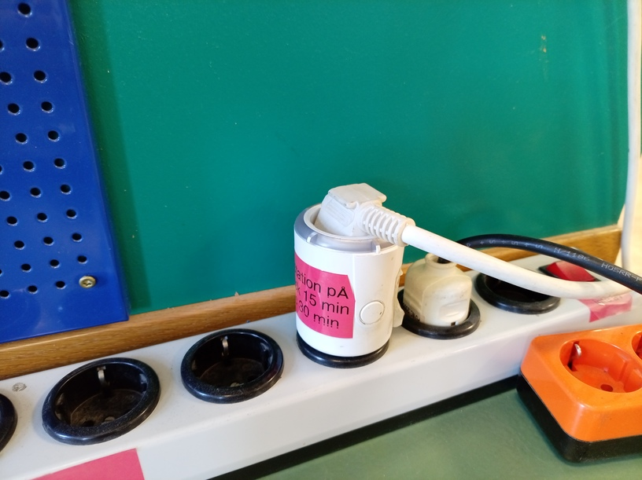
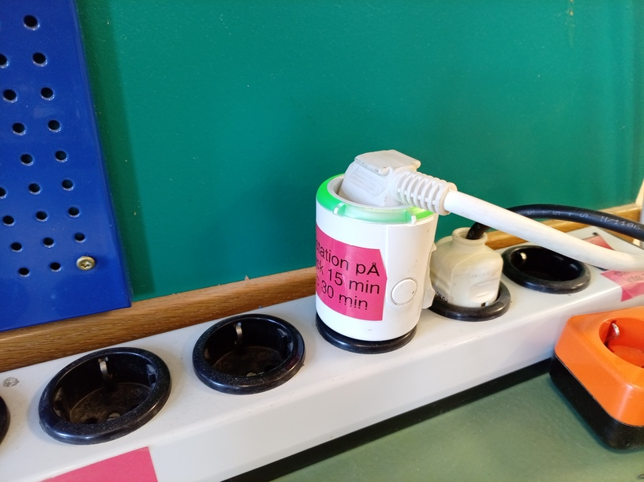
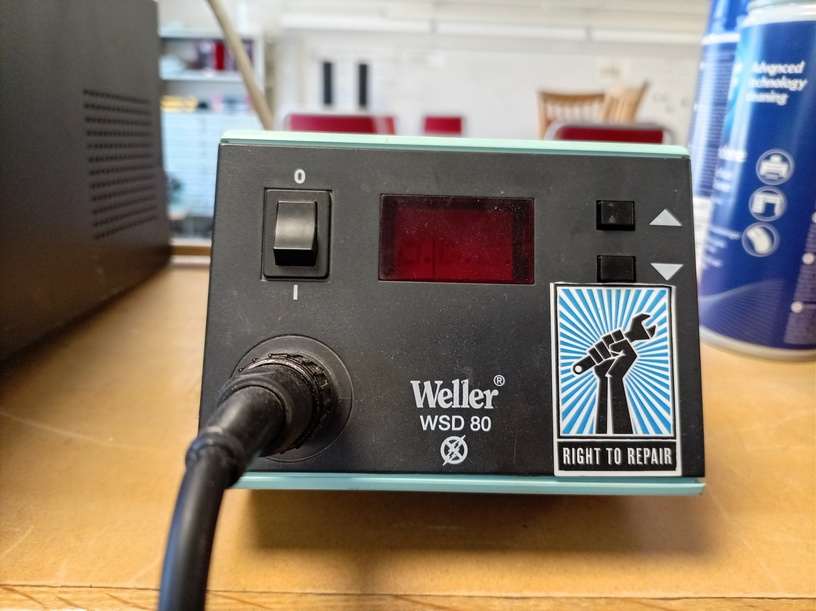
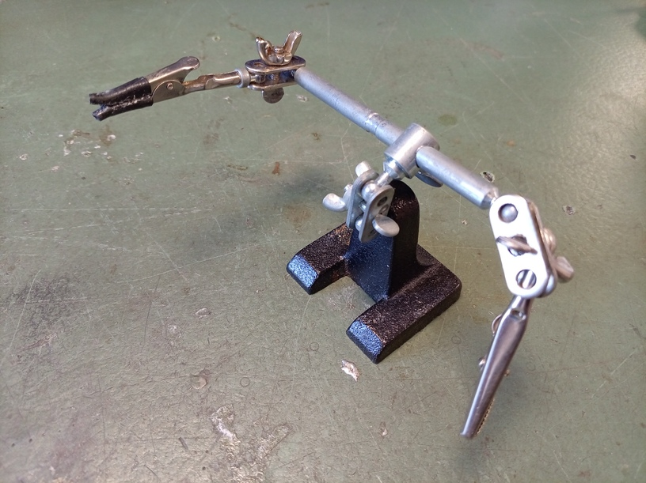
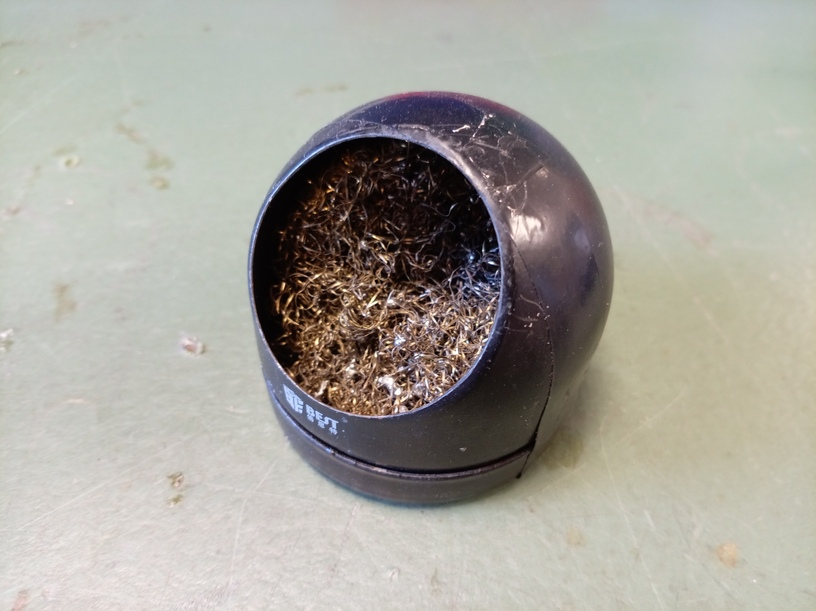
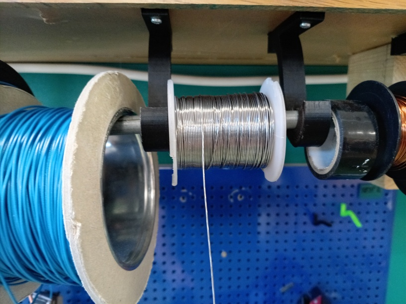
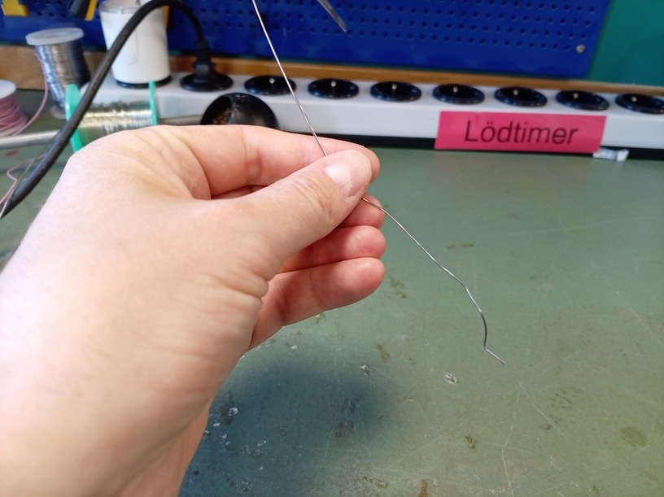
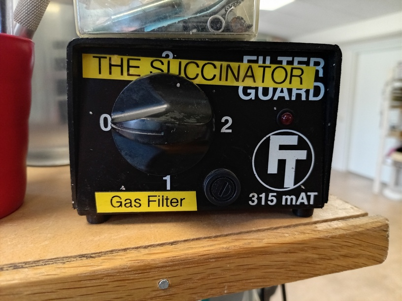

# 0. Att förbereda

Hitta en lödningsjärn.

Lödningstimern är förhoppningsvis släckt,
så att lödningsjärnet inte blir het efter
någon har glömt att släcka lödningsjärnet.

Tryck på den runda knappen åt sidan av lödningstimern.
Du får ser att en grön lampa lyser med varje tryck.
Varje gröna lampa är 15 minuter av lödning.

Sätt kontrollen av lödningsjärnet på, med en temperatur van 350 grad Celsius.

Hitta en så kallade 'hjälpande hand'.

Hitta kopparlockarna.

Hitta tännrullen.

Du kan drar ur tännrullen när du löder.

Sätt på ångutsugningen med att vrida knappen till två.

Nu är du reda för att löda!
