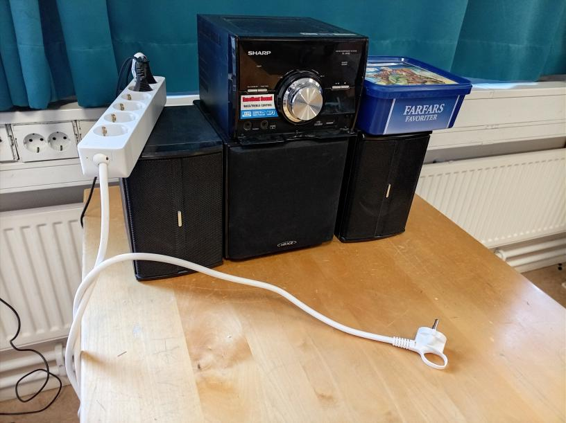
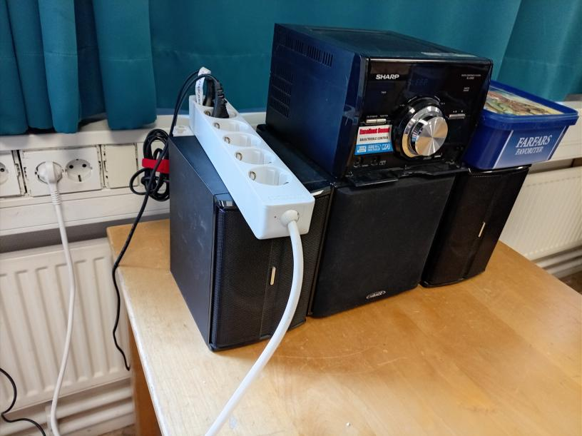
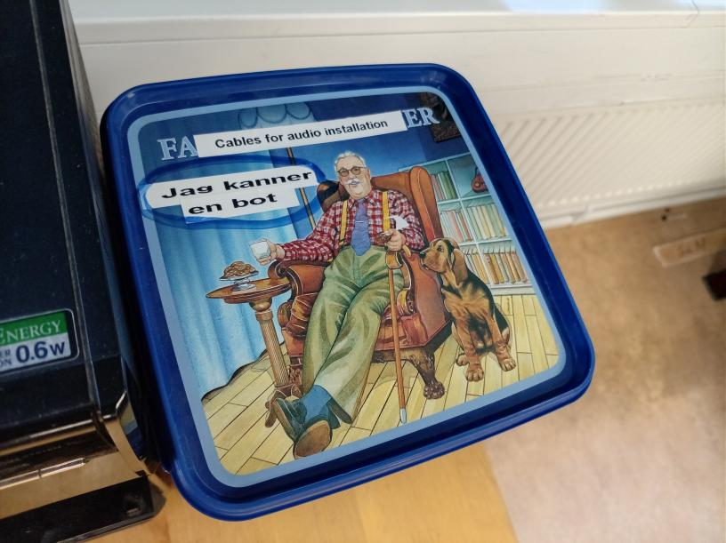
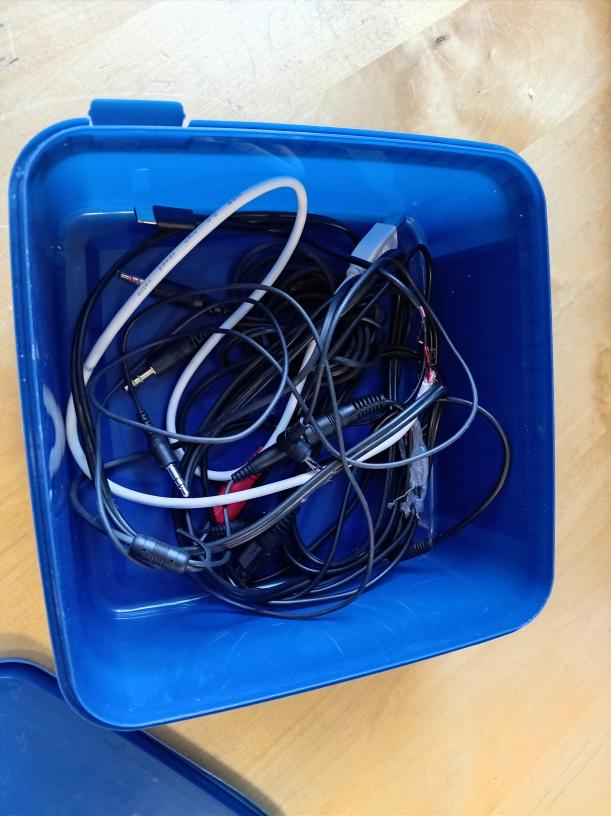
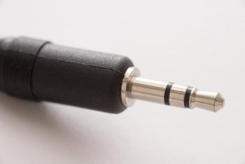
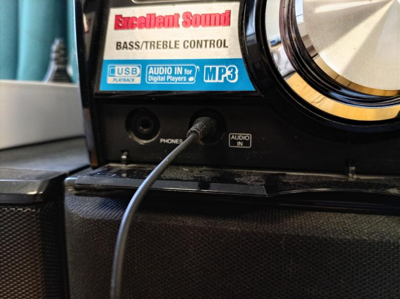
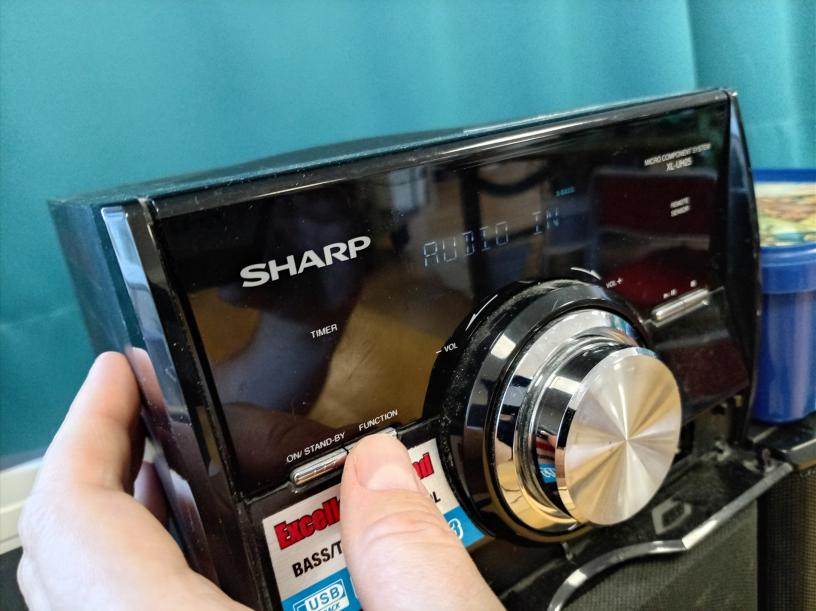
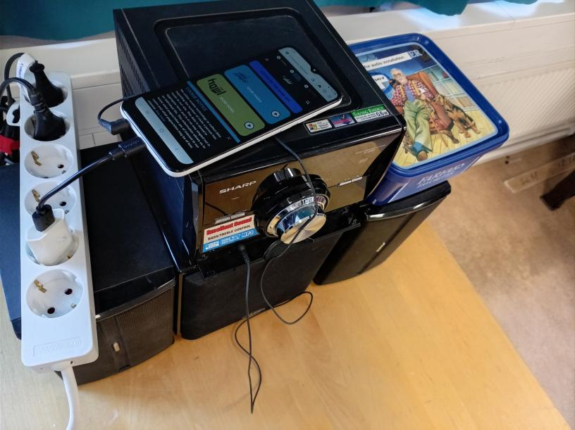
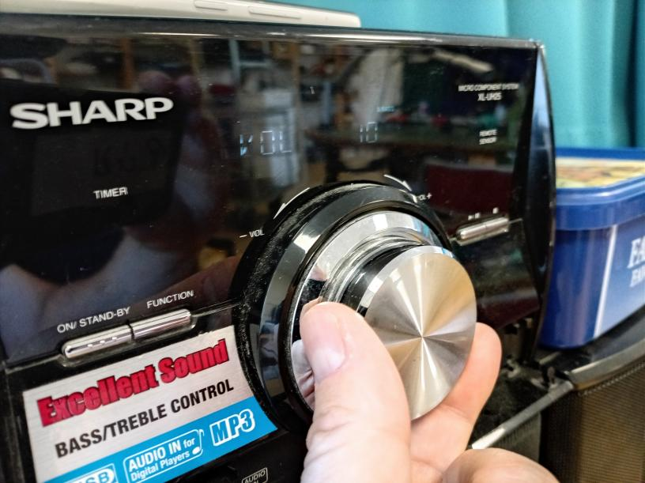

# Ljudinstallation hos Elverkstan

Att lägga på musik är enkelt, om du vet hur.

## 0.1. Att sätta på el

I början har du kanske inget el, för att den vita strömfördelare är inte på än.

Sticka i kontaktet av den vita strömfördelare in eluttaget.

## 0.2. Att hitta den rätta kabel

Öppna kabelboxen.

Kabelboxen är nu öppet.

Tar en kabel. Den måsta har en stereo mini-jack på
ena sida, som passer i 'Audio in' ingången av stereon.

## 0.3. Plugga i din ljudkälla

Sticka din kabel i 'Audio in' ingången av stereon.

Stick den andre änden av kabeln i din ljudkälla, t.ex. en mobiltelefon.

## 0.4. Sätt funktion till 'Audio in'

Tryck på 'Function' knappen till displayen visar 'Audio In'

## 0.5. Starta musik på din ljudkälla

Starta musik på din ljudkälla.

## 0.6. Ändra volymen

Ändra volymen för att får ljudinstallation att spela.

