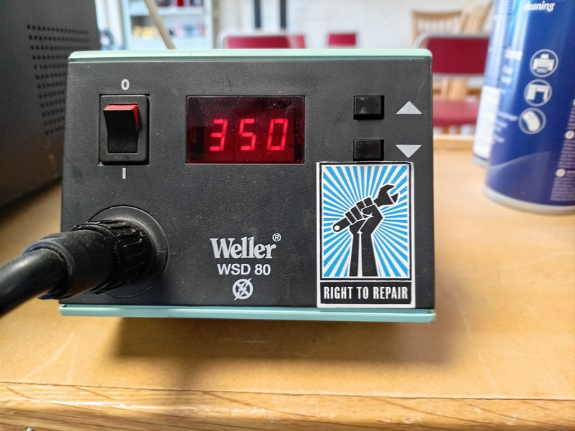
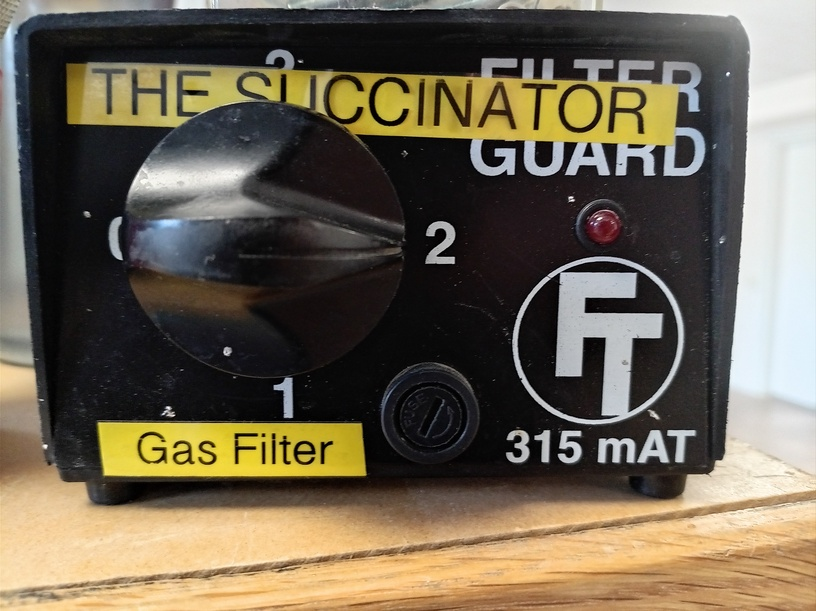
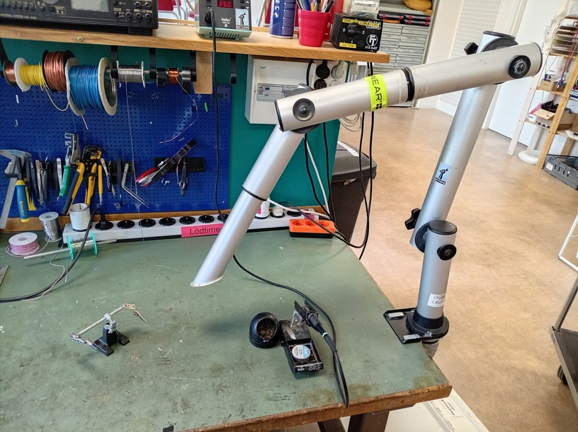
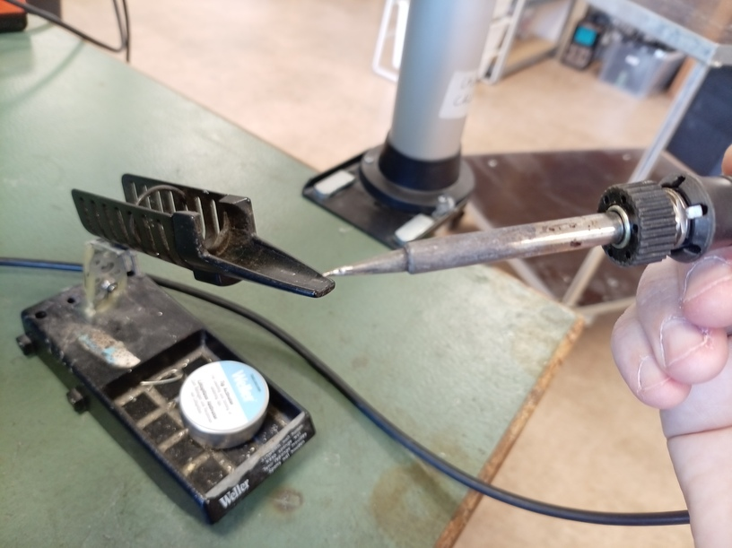
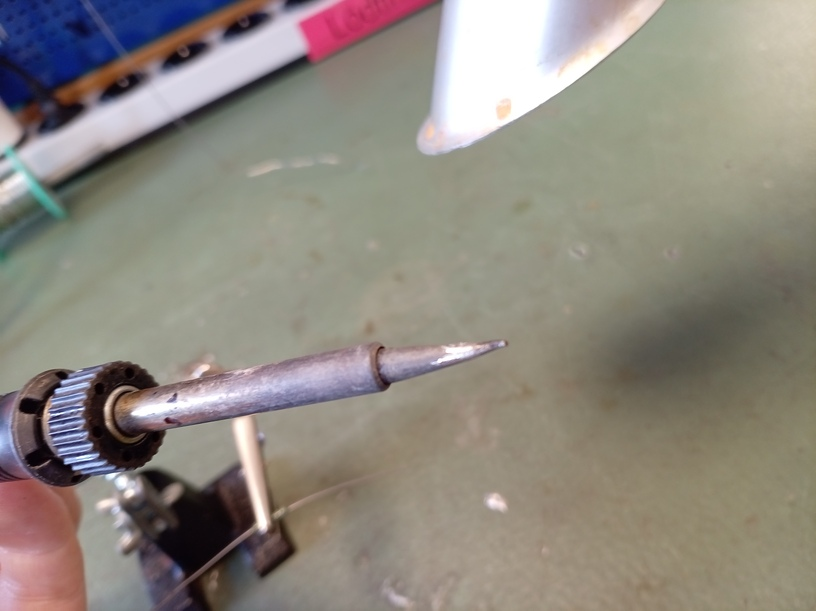
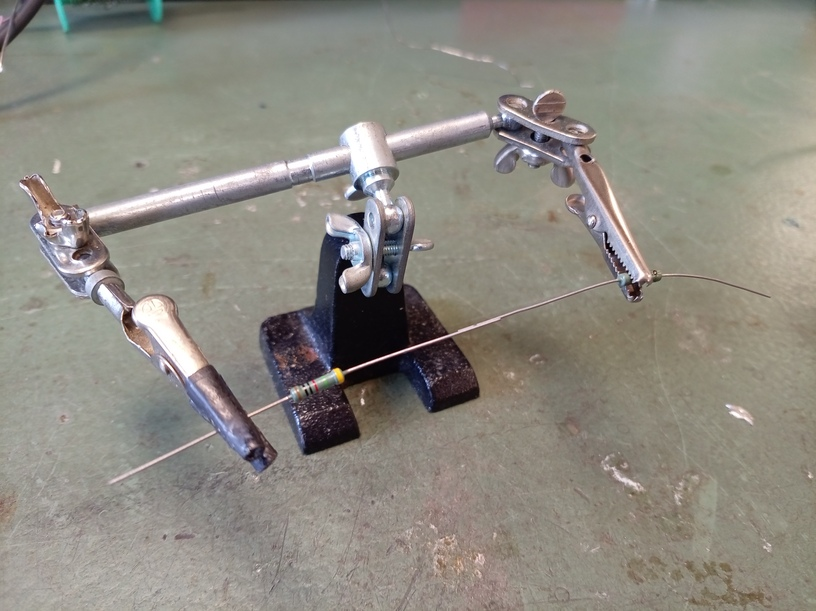
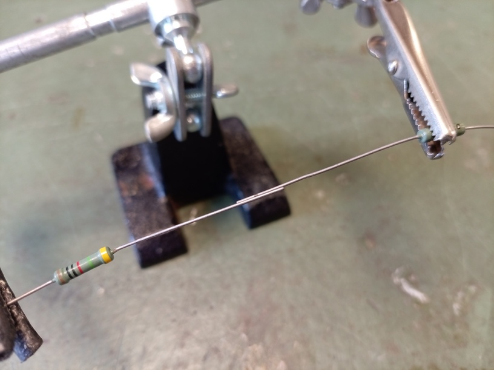
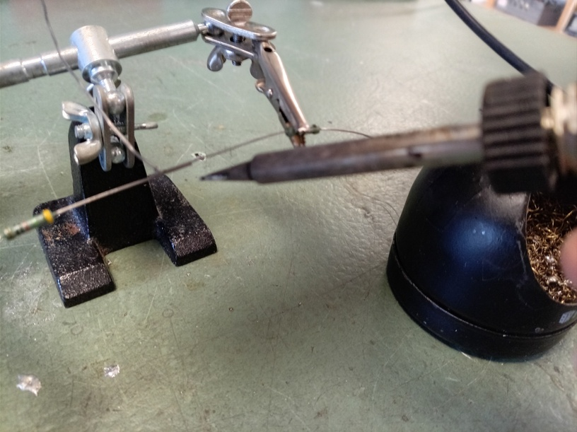
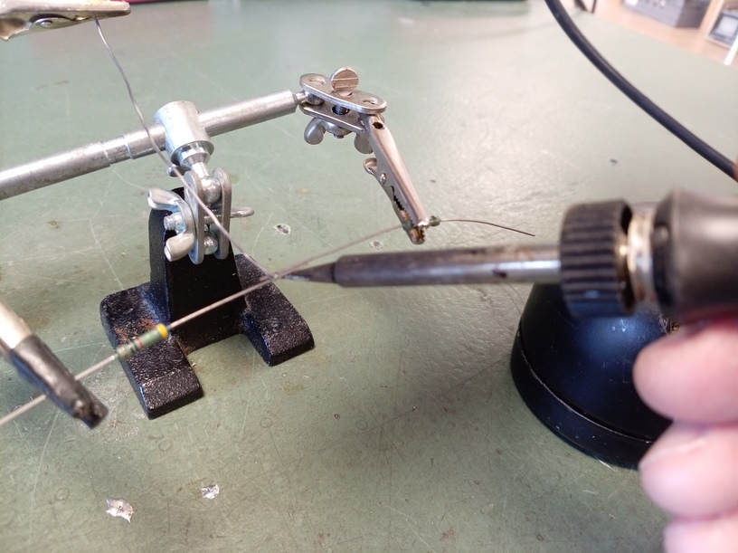
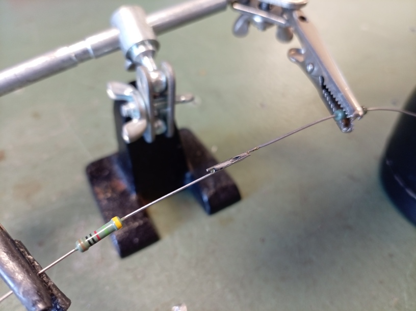

# 1. Din första lödning

## 1.1. Att starta

Sätt temperaturen av lödningsjärnet på 350 grad Celsius.
Displayen blinkar till temperature har blivit rätt hetta.

Sätt rökutsugsrör på två.

Sätt rökutsugsrör över bordet.

## 1.2. Spetsen av lödningsjärnet

Kolla att spetsen av lödningsjärn är silver (av tänn).

Så bör lödningsjärnet ser ut:

Spetsen ser svart ut om lödningsjärnet är lämnat kvar i dåligt skick:

Om lödningsjärnet har ingen silverspets:

- Tar på skyddsglasögon
- Borsta lödningsjärnet i kopparlockarna
- Hålla lödningsjärnet under rökutsugsrör
- Smälta tänn på spetsen
- Om den har ingen silverspets, gör igen :-)

## 1.3. Att löda

Sätt två resistorer mot varann i en hjälpande hand.

Det måste inte finnas tomrum mallan den två resistorer.

Sätt tänn också till lödningsplatsen.
Lödningsplatsen är var tråder av resistorer nuddar varan.

Om tänn är ovanpå lödningsplatsen,
hålla lödningsjärn **till undersida** lödningsplatsen.
Lödning är at hetta en ställe och får tänn att smälta
där (eller: lödning är inte att hetta tänn direkt)

När motstånderna har blivit het nog, smälter tännen och
flytter sig själva mellan resitortråderna.
Tar bort lödningsjärnet.

Lödningen bör ser ut smidigt.

## 1.4. Att stänga av

Efter du har lödat, stänger man av:

- Kolla om lödningsjärn har en silverspets.
  Om den har detta inte, lagar spetsen av lödningsjärnet
- Stäng av lödningsjärnet
- Stäng av rökutsugning

## 1.5. Slutuppgift

Öva med att starta, får en silverspets på lödningsjärnet (om det behövs),
att löda motstånder och att stänga av efteråt.

Gör minst fem lödningar för att öva.

Om du har övat tillrackligt, fråga en vuxen för att döma dig.
Visar hen din fem lödningar.
Den person får inte hjälpa dig.

Slutuppgiften år:

- Sätt på all
- Löda två motstånder tillsammans
- Stäng av

Domaren kollar om du har gjort all steg:

- Du har lödat under rökutsugning
- Ditt lödningsjärn har en silverspets
- Du hållade lördningsjärnet till tråderna av motstånder (inte direkt till
  tännet)
- Du fick en smidigt lödning
- Du stängde av lödningsjärnet och rökutsugning

Om du har glömt eller missförstod något, får du försöka igen efter
fem lödningar till.
