# 2. Att löda en Arduino shield

## 2.1. Att starta

Starta som vanligt:

- Sätt temperaturen av lödningsjärnet på 350 grad Celsius.
- Sätt rökutsugsrör på två.
- Sätt rökutsugsrör över bordet.
- Hitta skyddsglasögon
- Försäkra att lödningsjärn har en silverspets

Efter det är det dags att hitta en så kallade 'Arduino shield' (SV: 'kild'),
ett kretskort man stoppar i in en Arduino.
På den shielden lödar man sina elektronik.

Det finns fler shieldar, här är några exampler:

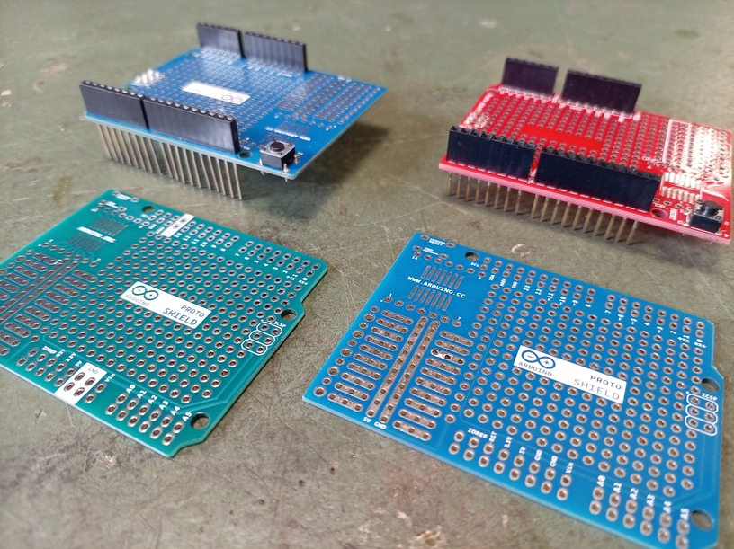

Vi använder då den Sparkfun shield;

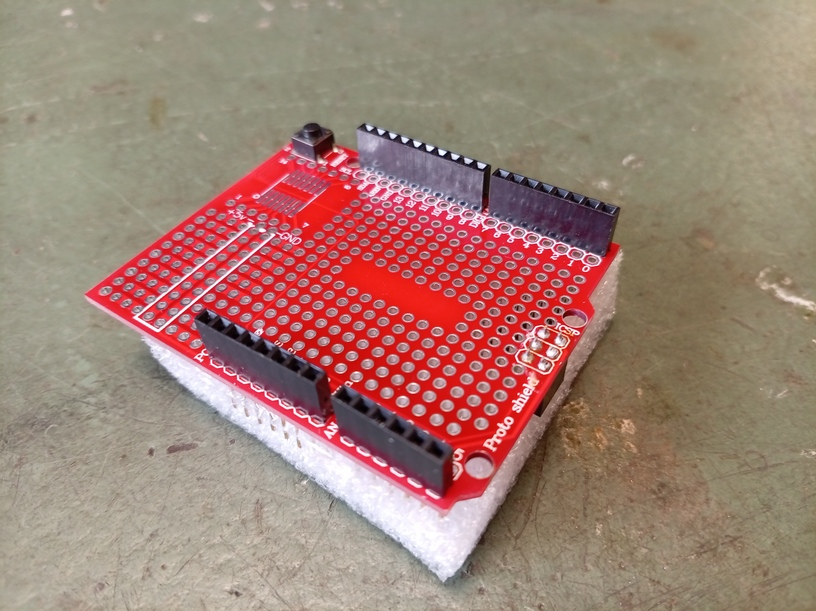

Målet är att löda en lysdiod mellan stift 13 och `GND`.
Så här ser det ut på en breadboard:

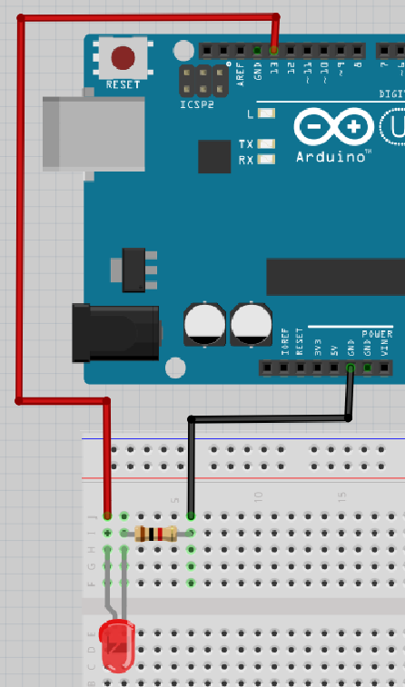

Så här ser det ut på schematiskt vis:

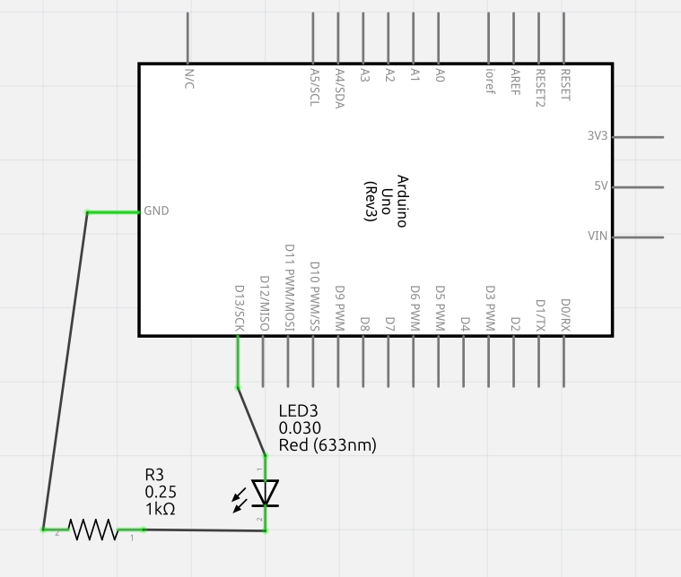

Vi ska göra samma elkrets på shielden.

## 2.2. Att löda i din stil

Shielden har ett extra hål för varje stift.
Dem är lätt att hitta: den är brevid stiften.

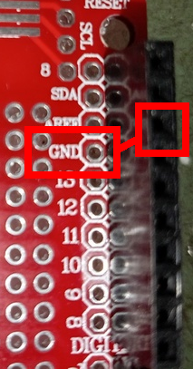

Med den här kunskap, kan man löda elkretsen på fler olika sätt.

Här är ett proffsigt exempel:

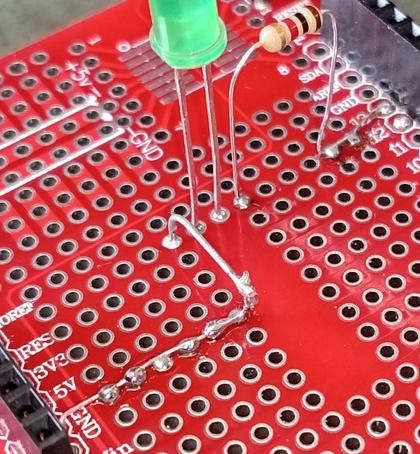

Här är ett mer enkelt exempel (OBS: den använder stift 8):

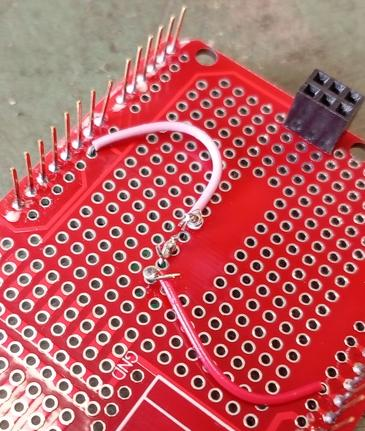

Du får bestämma hur du lödar. Om det funkar, har du gjort bra :-) .

## 2.3. Att skapa bryggar

Detta proffsigt exempel använde stel metal
för att förbinda hålar. Vi kaller denna
förbindingar 'bryggar'.

Man kann skapa bryggar av att skära av tråden
av en motstånd med en avbitartång.

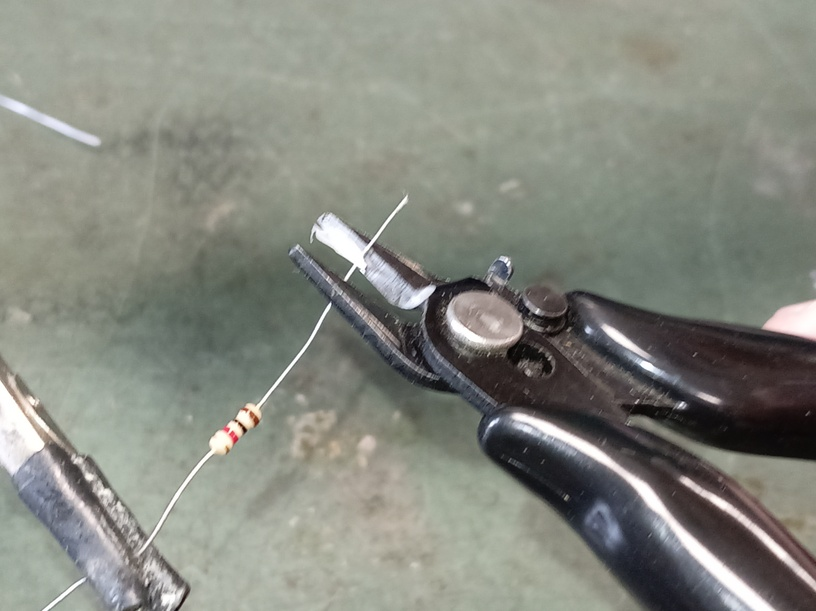

## 2.4. Att buga

En böjtång med platta käftar är bra för att böja kantiga vinklar.

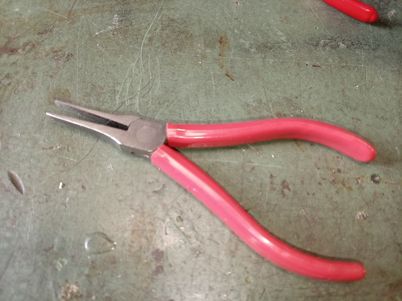

En låsringstång är en böjtång för att böja rundningar.

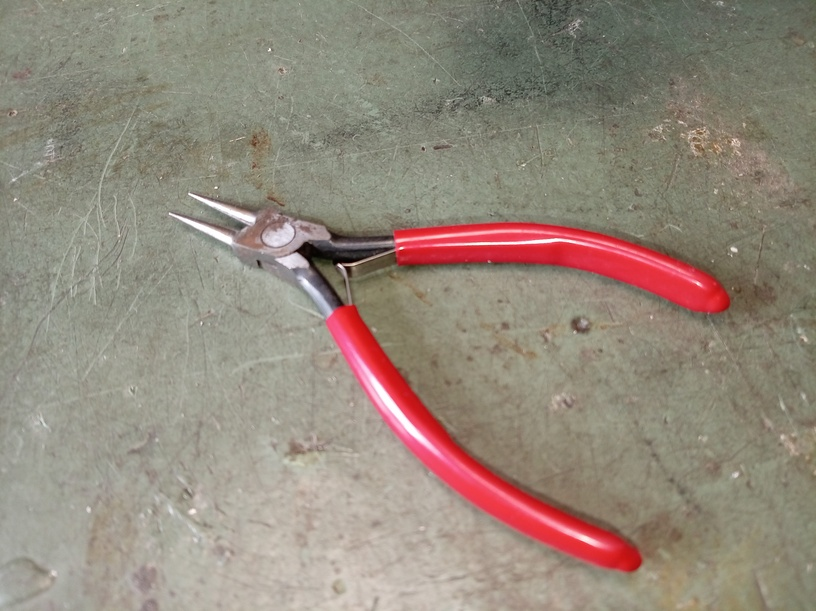

## 2.5. Att laga saker

Ibland gör man fel. I så fall är tännsugaren en nyttig redskap.

Tännsugare är ur                       |Tännsugare är in
---------------------------------------|---------------------------------------
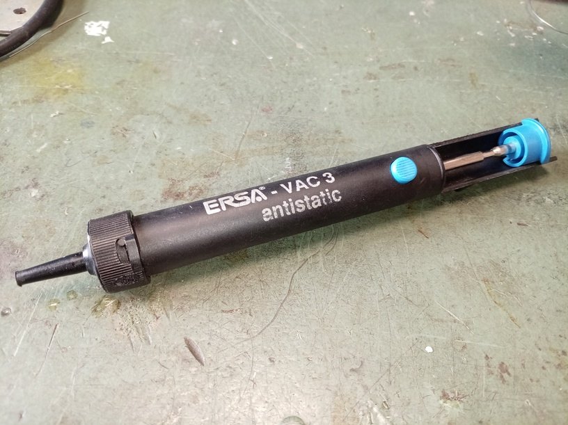|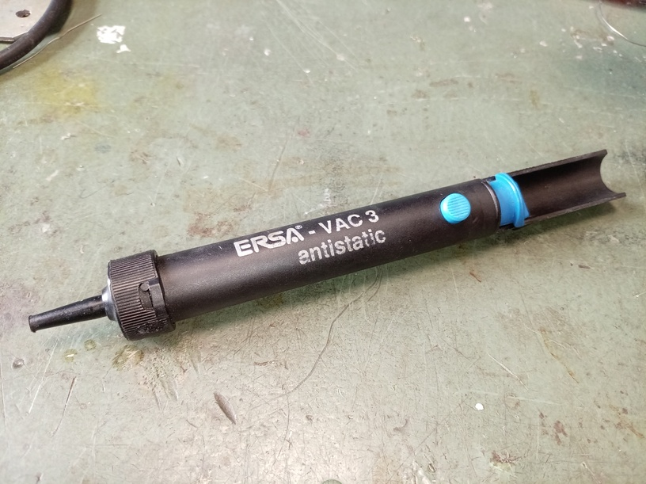

För att förberada, tryck in kolven av tännsugare. Nu är tännsugare
redo för att suga bort tänn.

Hetta tänn du vill suga bort med lödningsjärnet och håll tännsugare åt den
smältande tänn. Det är inget problem att tännsugaren blir het: den är byggt för
att motstå detta.

Nar tänn är smältat, tryck på knappen av tännsugaren. Förhoppningsvis,
om du har hållit tännsugarden rätt (och det kan vara tufft!), blir
tänn bortsugt. Om du trycker in kolven av tännsugaren kann du ser allt
tänn som har sugits ur.

## 2.6. Att testa

Om du har lödat klar, kann du sätta shielden på Arduinon.
Ledar all stiftar av shielden i hålar av Arduinon.
Du behöver inte trycka ner shielden kraftfult:
om stiftar är halvvägs hålorna funkar det redan.

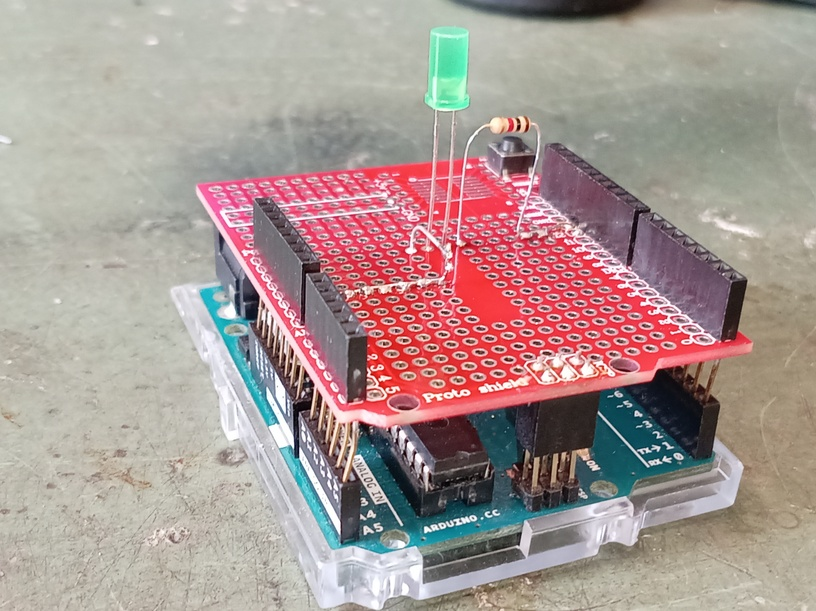

Koppla Arduinon till dator och start Arduino IDE.
I Arduino IDEn, ladda upp programmet 'Blink'
(under 'File | Examples | Basic | Blink').
Om lysdioden blinkar har du klarat detta!

## 2.6. Slutuppgift

Löda elkretsen på shielden i din favoritstil
och testar om det funkar.

Om det funkar, har du klarat av slutuppgiften.

