# 3. Att löda en bare-bone Arduino

## 3.1. Att starta

Starta som vanligt:

- Sätt temperaturen av lödningsjärnet på 350 grad Celsius.
- Sätt rökutsugsrör på två.
- Sätt rökutsugsrör över bordet.
- Hitta skyddsglasögon
- Försäkra att lödningsjärn har en silverspets

Efter det är det dags att hitta alla komponenter:

Bild                          |Namn
------------------------------|-------------------------------------
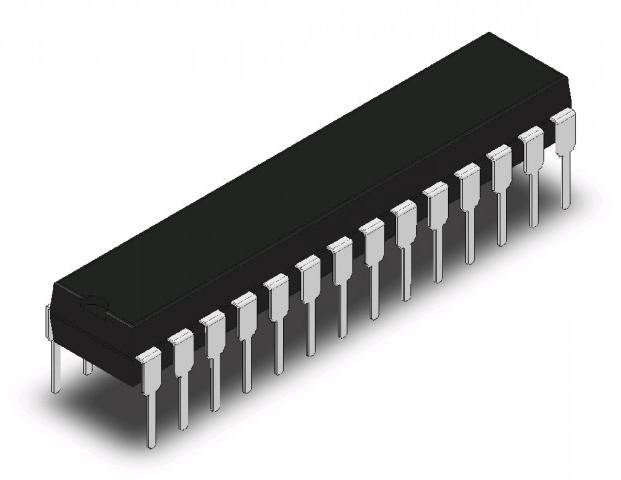|ATMega328P chip
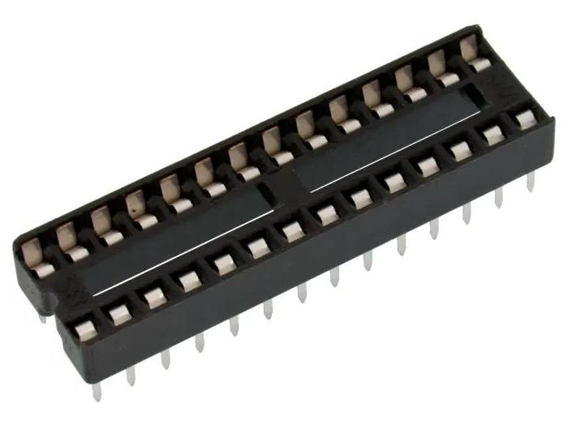   |Chipsockel
       |Kristall 16 MHz 20pF
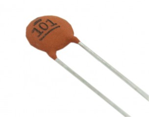   |Ceramiskst kondensator 22pF 50V
           |UBS-A hane kabel

Målet är att löda en bare-bone Arduino.
Så här ser det ut på en breadboard:

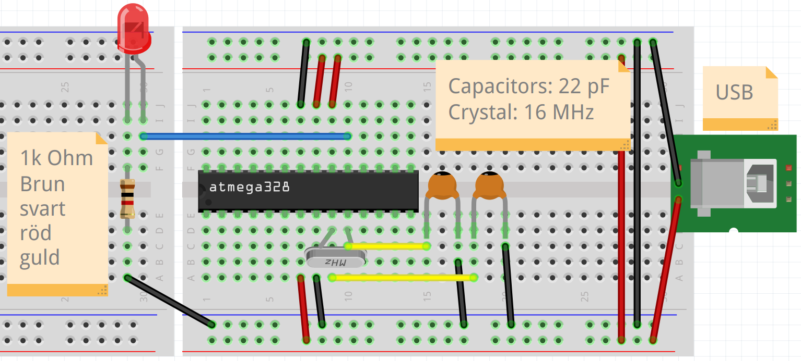

Så här ser det ut på schematiskt vis:

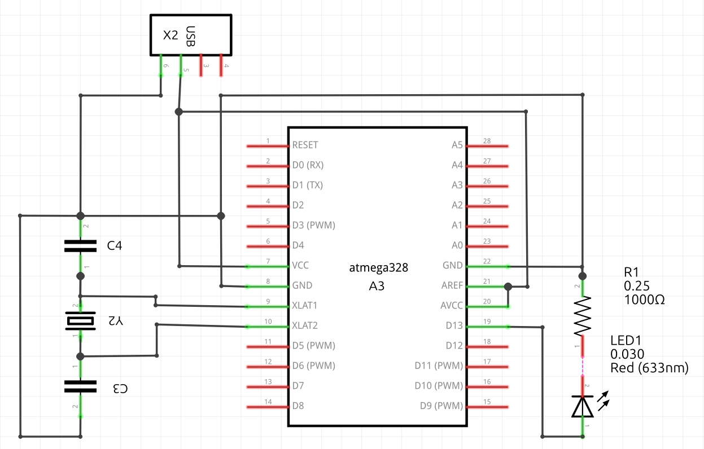

Vi ska göra samma elkrets.

## 3.2. Att löda i din stil

Vi kann löda en bare-bone Arduino på minst två sätt:

- punkt-till-punkt lödning: alla kopplingar
  går igenom luften
- lödning med en prototype board: mycket kopplingar
  händer på kretskortet, likadant en Arduino shield

punkt-till-punkt lödning                           |Lödning med en prototype board
---------------------------------------------------|-------------------------------------------------
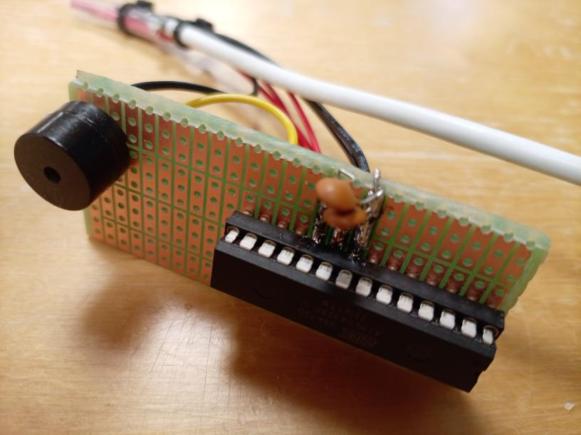|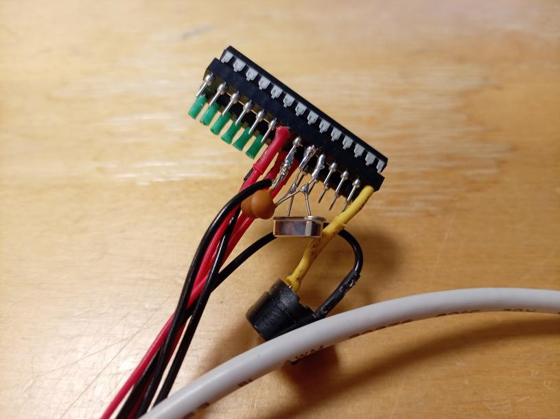

Du får bestämma vad du föredrar.
I den här fall är punkt-till-punkt lödning lättare.

## 3.3. Att skala en sladd

Med punkt-till-punkt lödning använder man mer sladdor,
som måste blir skalade.

Använder en skalvertyg, t.ex. den här skaltånger:

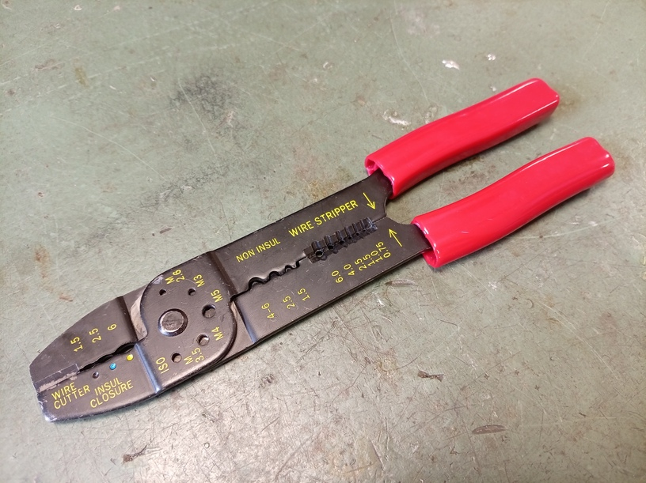

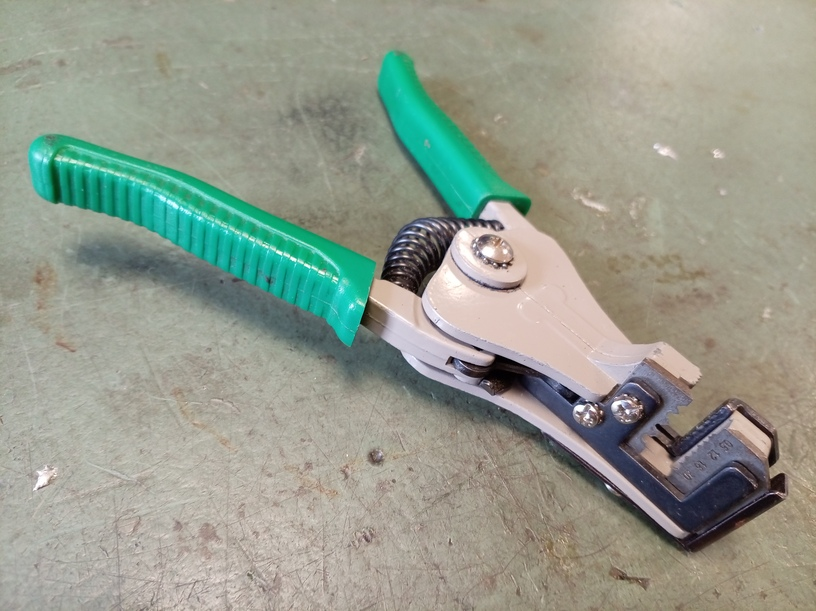

Lägg tråden i hålet med rätt storlek.

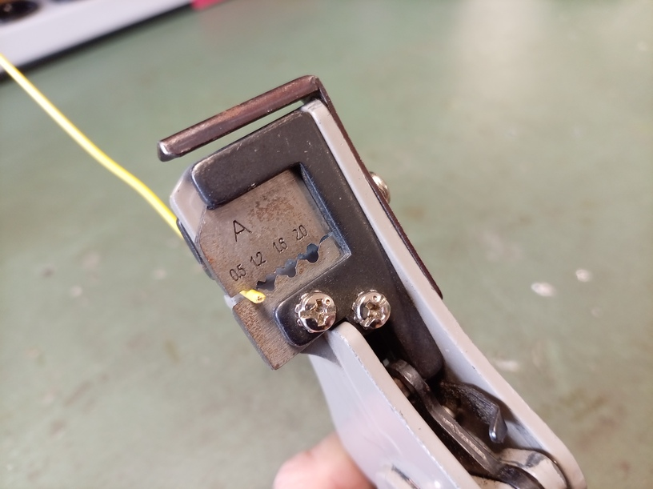

Med tråden i skaltången, drar av skalen.
Nu har du en skalad sladd.

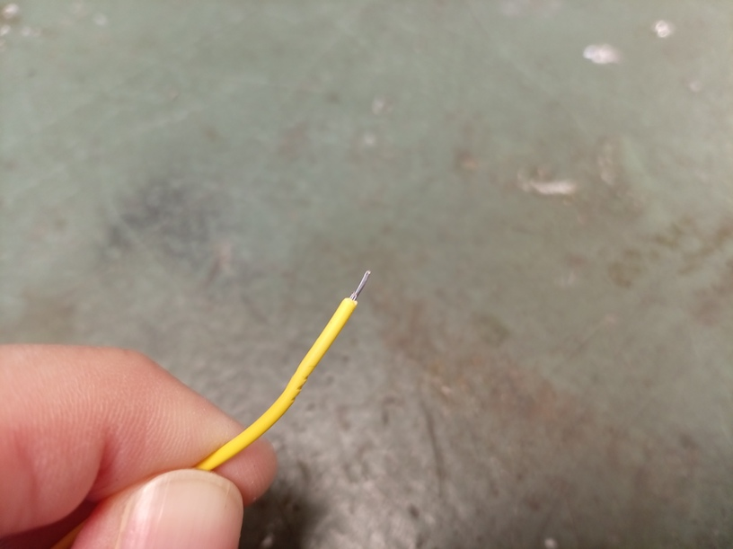

Ofta man lägger tänn på sladdens spets,
när sladden blir en enkelt koppling.

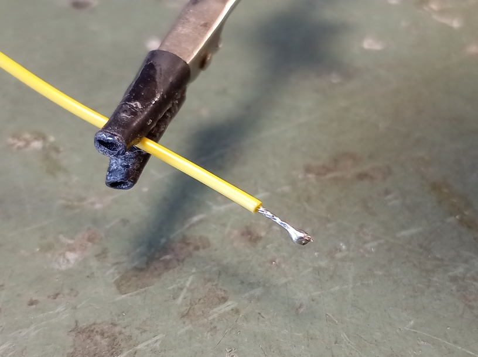

Om sladden blir del av en koppling med flera sladdor,
lägger man ofta ingen tänn på sladden-

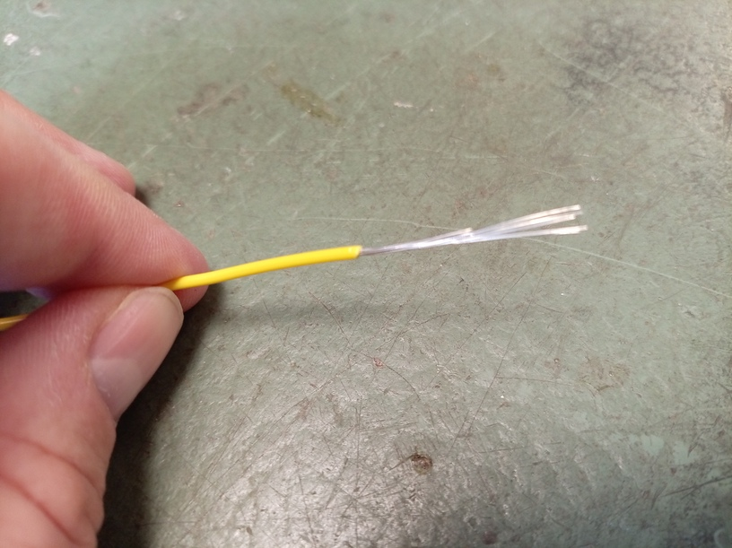

Om man har lagt tänn på sladdens spets (eller tidigare),
skär man av en del av sladden för att får rätta längden.

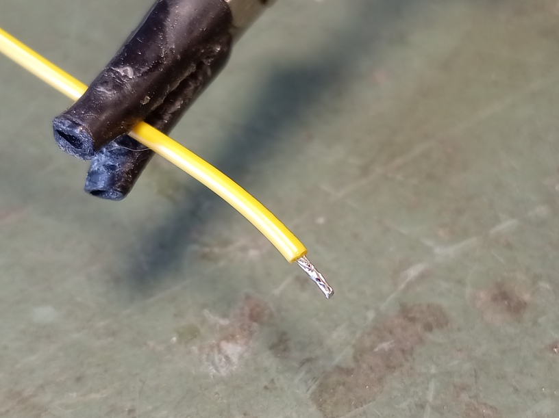

## 3.4. Att krympa

En fara med punkt-till-punkt lödning är att den blotta delar av sladdar
nå varann, med risk för kortslutning.

Leta efter den krympslangar.

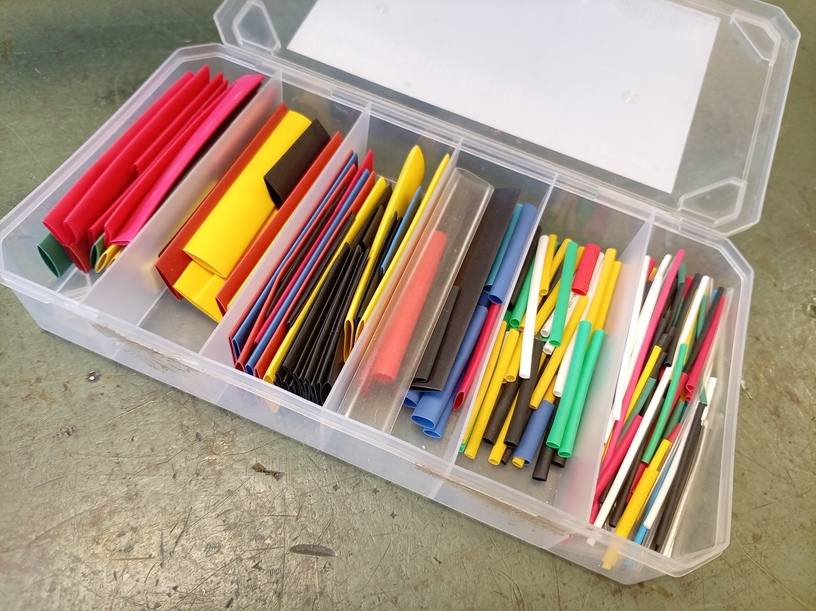

Hitta en krympslang som just passar omkring sladder du vill löda.
Använder en sax för att förkorta detta till den önskade längd.
Före en lödning, skjut din krympslang over en sladd, så att du kann
skjuta den över din förbindning efter lödningen.

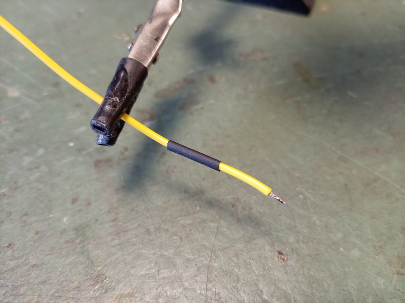

Löda som vanligt och skjuter krympslangen över förbindingen.

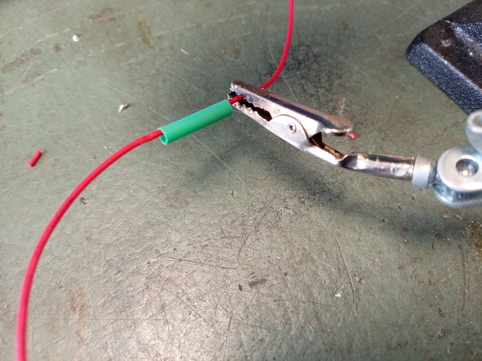

Håll kort din lödningsjärn år krympslangen.
Krympslangen krymper nu tajt om din förbindning.

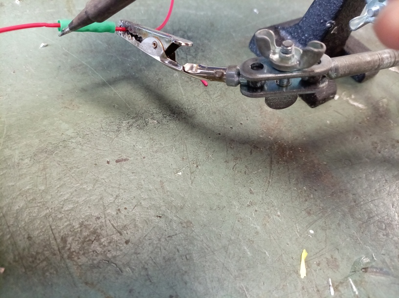

Nu kann du vara säker/säkrare att har ingen kortslutning.

## 3.5. Elförsörjning

För elförsörjning använder vi en USB-A sladd, som vi kann sticka i
en dator eller adaptorer.

Skär uppet sladden. I sladden finns det tre eller fyra sladdor.
Den röda sladden bär 5V spänningen. Om det finns en svart sladd:
den är GND. Om det finns ingen svart sladd, finns det en sladd utan hylsa
och den är GND istället.

## 3.6. Sockla måste vara tomt under lödningen

Chipsocklan måste var tomt, så att ATmege328P chip blir inte skadat
av lödningen. I all ritningar är båda socklan och chippen
ritat med glipan till vänster.

## 3.7. Kristallet är tuffast

Den tuffaste del är att löda kristallet och den två
kondensatorer. Båda kristallet och kondensatorer
måste vara nära chipsockla. Räkna noggrant vilka
ben av chipsocklan du löder!

Med punkt-till-punkt lödning är det här lättare:
löda en kondensatorer till varje ben av kristallet,
och efter det, löda kristallet till socklan.
Den olödade ben av kondensatorer gå båda till GND.

## 3.8. Glöm inte lysdioden

Lysdioden är den ena nyttiga sak vi kopplar till vår bare-bone
Arduino. Självklart: man kan anvanda fler stiftar och ladd upp
en mer komplicerat program till chippen.

## 3.9. Att löda mycket sladdor tillsammans

Det är normalt att har fler 5V sladdor och fler GND sladdor.

För att löda dem, skala dem lite längre och -utan tänn- fläkter
tråderna ihop.

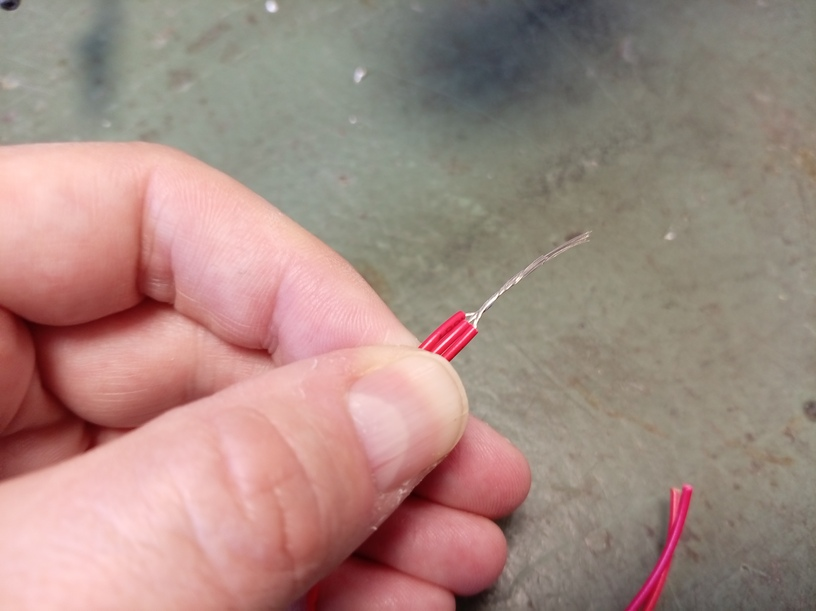

Lägg till tänn till alla tråder är lödade.

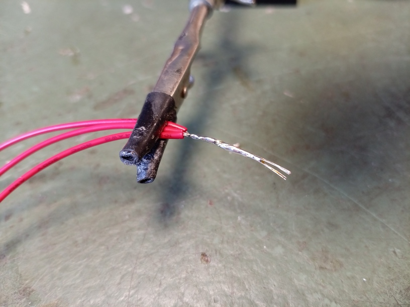

Också här använder man krympslang för att skydda emot kortslutning.

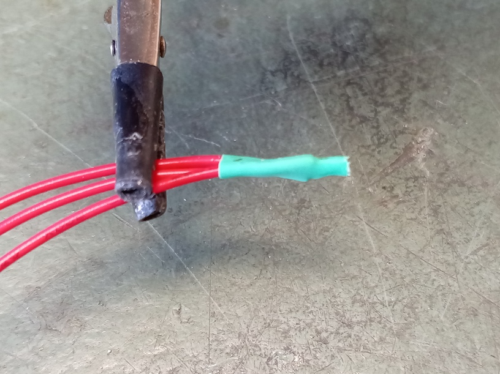

## 3.10. Slutuppgift

Löda en bare-bone Arduino i din favoritstil
och testar om det funkar.

Om det funkar, har du klarat av slutuppgiften.
